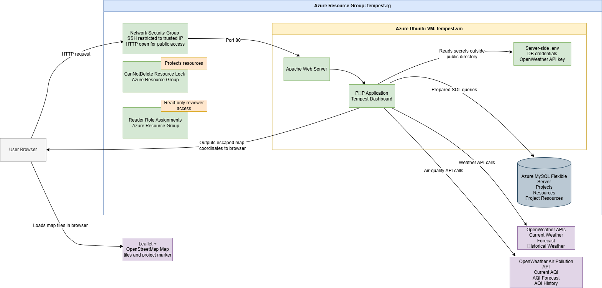

# Tempest - Construction Project Cloud Dashboard

## Overview

Tempest is a cloud-hosted construction project dashboard built with PHP, HTML, CSS and JavaScript.

The application combines construction project records, allocated equipment resources, location mapping, current weather data, air-quality readings, forecast data, historical lookup and project-specific risk recommendations.

Tempest is deployed on an Azure Ubuntu virtual machine running Apache and PHP. Project and equipment data is stored in an Azure-hosted MySQL database. Weather and air-quality data is requested server-side from OpenWeather APIs.

## Architecture



## Phases

Tempest was built in nine phases:

- **Phase 1:** Created the project structure, PHP layout, Azure VM, Apache setup and public landing page.
- **Phase 2:** Added Azure MySQL, the supplied project dataset, project selector, project details and allocated resources.
- **Phase 3:** Added Leaflet and OpenStreetMap mapping using project coordinates from the database.
- **Phase 4:** Added server-side OpenWeather current weather data, wind conversion and weather risk recommendations.
- **Phase 5:** Added OpenWeather air-quality data, AQI labels, pollutant display and AQI risk recommendations.
- **Phase 6:** Added forecast and historical lookup pages, date validation and controlled API limitation handling.
- **Phase 7:** Added modular Azure Bicep files for VM, network and security infrastructure.
- **Phase 8:** Hardened security through secret handling, validation, escaping, prepared statements, NSG rules, database firewall, resource lock and read-only access evidence.
- **Phase 9:** Finalised the README, About page, architecture diagram, evidence screenshots, demo video and ZIP package.

## Solution

```text
Narrated demo: https://www.youtube.com/watch?v=iDxd3bfApVc
Repository: https://github.com/Blakem07/Tempest
Architecture diagram: docs/architecture.png
Evidence folder: docs/
Infrastructure as Code: IaC/
```

## Features

- Azure-hosted PHP web application
- Project selector populated from Azure MySQL
- Project title, description, manager, location and coordinates
- Allocated equipment resources and conditions of use
- Leaflet map using OpenStreetMap tiles
- Map marker based on project latitude and longitude
- Current weather panel using OpenWeather
- Weather risk recommendations for crane, digger and dumper truck rules
- Current air-quality panel using OpenWeather
- AQI label and pollutant display
- AQI risk recommendations for earth-moving equipment
- 8-day weather forecast page where supported by the API plan
- Air-quality forecast where available
- Historical weather and air-quality lookup by selected date
- Input validation and controlled error messages
- Infrastructure as Code using Azure Bicep
- Lightweight implementation using PHP, HTML, CSS and JavaScript

## Architecture

Architecture diagram:

```text
docs/architecture.png
```

High-level architecture:

```text
User Browser
    |
    | HTTP request
    v
Azure Network Security Group
    |
    | Port 80
    v
Azure Ubuntu Virtual Machine
    |
    v
Apache Web Server
    |
    v
PHP Application
    |
    | Prepared SQL queries
    v
Azure MySQL Flexible Server

PHP Application
    |
    | Server-side API requests
    v
OpenWeather APIs

Browser
    |
    | Leaflet and OpenStreetMap tiles
    v
Project Location Map
```

The browser sends HTTP requests to the Apache web server running on the Azure Ubuntu VM. Apache serves the PHP application from the public web directory. The PHP application reads server-side environment values, queries Azure MySQL with prepared SQL statements, requests OpenWeather data server-side, and outputs escaped project data to the browser. Leaflet displays map tiles from OpenStreetMap and places the project marker using latitude and longitude retrieved from the database.

## Technology Stack

- Azure Virtual Machine
- Ubuntu
- Apache
- PHP
- HTML
- CSS
- JavaScript
- Azure Database for MySQL Flexible Server
- Azure Network Security Group
- Azure Resource Locks
- Azure Role-Based Access Control
- Azure Bicep
- Leaflet
- OpenStreetMap
- OpenWeather Current Weather API
- OpenWeather Forecast API
- OpenWeather Historical Weather API
- OpenWeather Air Pollution API

## Cloud Resources

Azure resources used:

- Resource group
- Ubuntu virtual machine
- Public IP address
- Virtual network
- Subnet
- Network interface
- Network security group
- Managed disk
- Azure MySQL Flexible Server
- MySQL firewall rules
- VM resource lock

The IaC files define the repeatable VM, networking and security configuration.

## Database Design

The application uses an Azure-hosted MySQL database.

Tables:

```text
projects
resources
project_resources
```

### `projects`

Stores construction project information.

```text
id
title
description
manager
location_name
latitude
longitude
created_at
```

### `resources`

Stores equipment and resource information.

```text
id
name
resource_type
conditions_of_use
```

### `project_resources`

Stores the relationship between projects and allocated resources.

```text
id
project_id
resource_id
```

Project data is imported into MySQL and linked to the allocated construction resources.

## Security Controls

Tempest includes these controls:

- SSH access to the Azure VM is restricted.
- HTTP is open for public browser access.
- Database access is restricted through Azure MySQL firewall rules.
- Runtime secrets are configured on the Azure VM only.
- API keys and database credentials are not included in the submitted ZIP.
- Placeholder environment values are provided in `.env.example`.
- Local parameter files are not included in the submitted ZIP.
- PHP service files make API calls server-side.
- OpenWeather keys are not exposed in frontend JavaScript.
- User-controlled project IDs are validated with `FILTER_VALIDATE_INT`.
- Historical date input is validated server-side.
- Future historical dates are rejected.
- SQL queries using user-controlled values use prepared statements.
- Dynamic output is escaped with `htmlspecialchars()` through the `e()` helper.
- User-facing errors are controlled and do not expose raw stack traces, SQL errors or API keys.
- A `CanNotDelete` resource lock is applied to reduce accidental deletion risk.

## Sustainability Considerations

Tempest is designed to reduce avoidable compute and transfer overhead by:

- Avoiding heavy frontend frameworks
- Using lightweight HTML, CSS and vanilla JavaScript
- Keeping assets minimal
- Using server-side API requests
- Avoiding unnecessary client-side dependencies
- Using a right-sized Azure VM
- Using efficient database queries
- Keeping static assets minimal

## API Integrations

### OpenWeather Current Weather API

Used to retrieve current weather for the selected project coordinates.

Displayed data:

```text
Temperature
Wind speed
Weather description
Humidity
Timestamp
```

### OpenWeather Forecast API

Used to retrieve forecast weather data for the selected project. Forecast data is displayed with daily weather risk recommendations where available.

### OpenWeather Historical Weather API

Used for historical weather lookup based on a selected date.

### OpenWeather Air Pollution API

Used for current air-quality readings, air-quality forecast data where available, and historical air-quality lookup.

Displayed data includes:

```text
AQI value
AQI label
PM2.5
PM10
NO2
CO
```

### Leaflet and OpenStreetMap

Leaflet renders the interactive project map. OpenStreetMap provides the tile layer. Project latitude and longitude are retrieved from the database and passed to the browser through escaped HTML data attributes.

## Risk Recommendation Logic

### Weather Risk

Weather recommendations are generated server-side.

Rules:

```text
If wind speed is greater than 20mph and the project includes Crane:
Crane works should not be carried out.

If weather description is heavy intensity rain, very heavy rain or extreme rain,
and the project includes both Digger and Dumper Truck:
Works may be delayed due to rainfall.
```

The weather risk engine evaluates all rules before returning, so multiple warnings can be displayed together.

### Air-Quality Risk

AQI labels follow the OpenWeather scale:

```text
1 Good
2 Fair
3 Moderate
4 Poor
5 Very Poor
```

Rules:

```text
AQI Good or Fair:
Earth-moving work can continue.

AQI Moderate, Poor or Very Poor, with Digger or Dumper Truck allocated:
Earth-moving work should not be carried out.
```

The AQI recommendation includes the AQI value, AQI label and affected resources where applicable.

## Forecast and Historical Lookup

### Forecast Page

The forecast page allows the user to:

```text
Select a project
View forecast weather data
View available air-quality forecast data
See daily weather risk recommendations
See daily AQI recommendations where data is available
```

### History Page

The history page allows the user to:

```text
Select a project
Select a historical date
View historical weather data
View historical air-quality data
Receive a controlled message if data is unavailable
```

Validation includes:

```text
Invalid project IDs are rejected.
Invalid dates are rejected.
Future dates are rejected.
API failures show controlled messages.
Raw API errors are not shown to the user.
```

## Infrastructure as Code

Infrastructure as Code is stored in:

```text
IaC/
```

Structure:

```text
IaC/
├── main.bicep
├── parameters.dev.example.json
├── parameters.prod.example.json
├── README.md
└── modules/
    ├── network.bicep
    ├── security.bicep
    └── vm.bicep
```

The Bicep templates define:

- Virtual network
- Subnet
- Network security group
- SSH rule restricted to a trusted IP
- HTTP rule for public access
- Public IP
- Network interface
- Ubuntu VM
- Optional `CanNotDelete` resource lock

## Local Setup

Run from the project root:

```bash
php -S localhost:8080 -t public
```

Visit:

```text
http://localhost:8080
```

Required local environment values are shown in `.env.example`.

Example:

```env
APP_ENV=development
APP_NAME="Tempest Construction Project Cloud Dashboard"

DB_HOST=
DB_NAME=
DB_USER=
DB_PASSWORD=

OPENWEATHER_API_KEY=
OPENWEATHER_HISTORY_CITY_ID=2641673
```

## Testing

### PHP Syntax Check

```bash
find . -name "*.php" -print0 | xargs -0 -n1 php -l
```

### Local Server Test

```bash
php -S localhost:8080 -t public
```

### Cloud Page Tests

The live pages were checked in the browser and through HTTP status checks.

Pages tested:

```text
/
project.php
forecast.php
history.php
```

Expected result:

```text
HTTP 200 OK
```

### Input Validation Tests

Test cases:

```text
/project.php?project_id=test
/forecast.php?project_id=test
/history.php?project_id=test
/history.php?project_id=2&history_date=2099-01-01
```

Expected controlled responses:

```text
Invalid project selected.
Historical lookup cannot use a future date.
```

## Known Limitations

- The application currently uses HTTP. HTTPS could be added with a domain name and TLS certificate.
- Air-quality forecast availability may be shorter than the 8-day weather forecast range.
- Historical weather uses the OpenWeather history endpoint with the Newcastle city ID because the project sites are based in central Newcastle.
- The database is currently managed outside the Bicep templates.
- VM infrastructure is defined in IaC, while application deployment is handled separately.
- API availability depends on the active OpenWeather subscription and rate limits.

## References

- Microsoft Azure documentation for virtual machines, networking, role assignments, resource locks and Bicep.
- Apache HTTP Server documentation.
- PHP documentation for PDO, input filtering and output escaping.
- OpenWeather documentation for current weather, forecast, historical weather and Air Pollution API.
- Leaflet documentation.
- OpenStreetMap tile usage and attribution guidance.
- Website Carbon information for sustainability awareness.
